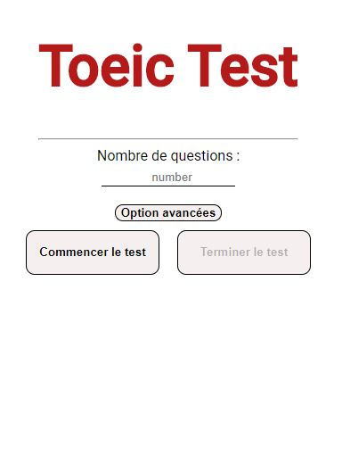
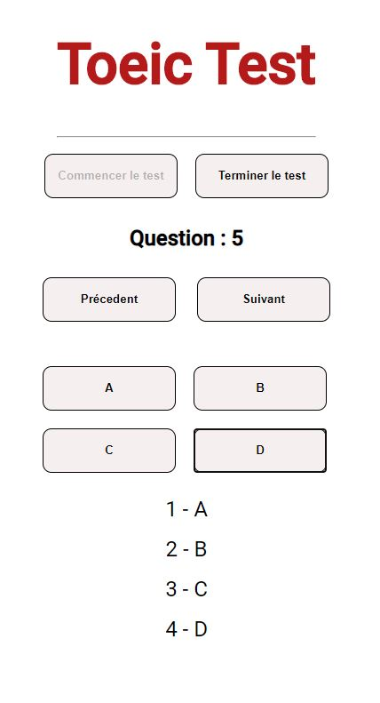

# Exam Answer Interface

[Lien de l'application](https://romainguarinoni.github.io/Exam_answer_interface/)

Cette petite application permet de noter les réponses d'un QCM et de les sauvegarder. Cela évite de devoir les écrire sur du papier ( ce qui peut être long et fastidieux pour de longs exam).

Initialement crée pour l'examen du Toeic, cette application peut également être utilisé pour tout type de tests a **choix mulitples**.

## Comment ça marche ?

1. Selectionner le **nombre de questions à répondre** et cliquez sur **commencer les test**
2. Répondez aux questions en cliquant surt les boutons. Vous pouvez toujours **changer vos réponses** ou **sauter des questions** à votre guise.
3. Pour supprimer le test, cliquez sur **Terminer le test** et vous pouvez en commencer un nouveau. ( Notez que si vous commencer un nouveau test, vos anciennes réponses ne sont plus sauvegardées).

**crée par Romain Guarinoni**
